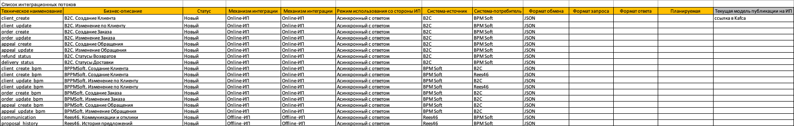

Установите сертификат:

```
mkdir -p /usr/local/share/ca-certificates/Yandex && \
wget "https://storage.yandexcloud.net/cloud-certs/CA.pem" -O /usr/local/share/ca-certificates/Yandex/YandexCA.crt
```
Пример команды для отправки сообщения в топик с SSL:

```
echo "test message" | kafkacat -P  \ 
  -b rc1c-e5bcr1ief01crf2q.mdb.yandexcloud.net:9091 \ 
  -t <topic> \ 
  -X security.protocol=SASL_SSL \ 
  -X sasl.mechanisms=SCRAM-SHA-512 \ 
  -X sasl.username=<producer-name> \ 
  -X sasl.password=<producer-password> \ 
    -X ssl.ca.location=/usr/local/share/ca-certificates/Yandex/YandexCA.crt -
Z -K: 
```
Пример команды для получения сообщений из топика:

```
kafkacat -C \ 
  -b rc1c-e5bcr1ief01crf2q.mdb.yandexcloud.net:9091 \ 
  -t <topic> \ 
  -X security.protocol=SASL_SSL \ 
  -X sasl.mechanisms=SCRAM-SHA-512 \ 
  -X sasl.username=<consumer-name> \ 
  -X sasl.password=<consumer-password> \ 
    -X ssl.ca.location=/usr/local/share/ca-certificates/Yandex/YandexCA.crt -
Z -K:
```


