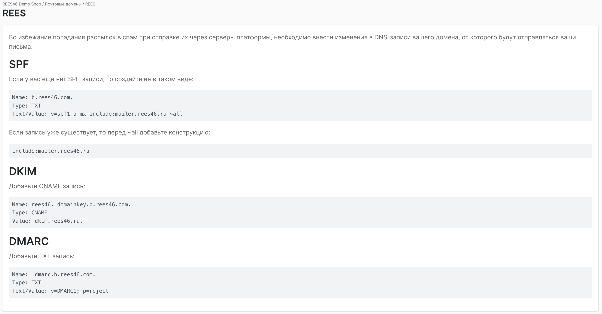

# Товарный фид

🔗 [https://rees46.ru/docs/ru/setup/products/](https://rees46.ru/docs/ru/setup/products/)

---

# Трекинг событий

## Обязательные события

### Просмотр товара

Передается на странице товара или на странице категории, если для просмотра используется модальное окно.
**Важно:** если просмотр товара происходит после перехода из инструмента (поиск, товарные рекомендации и т.д.) — в событии просмотра необходимо передать параметры инструмента:
`recommended_by`, `recommended_code`
🔗 [https://reference.api.rees46.com/#user-viewed-a-product](https://reference.api.rees46.com/#user-viewed-a-product)

---

### Добавление, удаление, обновление корзины

Передаётся с любой страницы, где товар можно добавить в корзину, а также со страницы самой корзины, где можно изменять её состав.
**Важно:** если добавление товара в корзину происходит после перехода из инструмента (поиск, товарные рекомендации и т.д.) — в событии просмотра необходимо передать параметры инструмента:
`recommended_by`, `recommended_code`
🔗 [https://reference.api.rees46.com/#user-added-product-to-cart](https://reference.api.rees46.com/#user-added-product-to-cart)

---

### Оформление заказа

🔗 [https://reference.api.rees46.com/#user-purchased-products](https://reference.api.rees46.com/#user-purchased-products)

---

### Просмотр категории

🔗 [https://reference.api.rees46.com/#user-viewed-a-category](https://reference.api.rees46.com/#user-viewed-a-category)

---

### Поисковый запрос

🔗 [https://reference.api.rees46.com/#user-searched-something](https://reference.api.rees46.com/#user-searched-something)

---

**P.S. Параметры рекомендованного события**

* `recommended_by`:

  * рекомендации — `dynamic`
  * быстрый поиск — `instant_search`
  * полный поиск — `full_search`
* `recommended_code`:

  * рекомендации — код блока
  * быстрый или полный поиск — поисковый запрос

---

## Необязательные события

### Добавление, удаление, обновление избранного

🔗 [https://reference.api.rees46.com/#user-added-product-to-favorites](https://reference.api.rees46.com/#user-added-product-to-favorites)
🔗 [https://reference.api.rees46.com/#user-removed-product-from-favorites](https://reference.api.rees46.com/#user-removed-product-from-favorites)

---

### Кастомные события

🔗 [https://reference.api.rees46.com/#track-custom-event](https://reference.api.rees46.com/#track-custom-event)

---

## Проверка передачи событий

**Личный кабинет магазина -> Настройки -> Статус подключения**

---

# Профиль пользователя

При каждом изменении данных пользователя (авторизация, регистрация, изменение данных) необходимо их передавать.
🔗 [https://reference.api.rees46.com/#user-39-s-profile](https://reference.api.rees46.com/#user-39-s-profile)

---

# Интеграция инструментов

## Товарные рекомендации

При работе с товарными рекомендациями нужно учитывать, что алгоритмы блока ожидают данные со страницы, например ID просматриваемой категории или товара, поисковый запрос, локация, бренд. Ниже приведен общий рекомендованный алгоритм установки блоков на страницах сайта.

* **Главная** — нет обязательных параметров
* **Категория** — необходимо передать ID текущей категории
* **Товар** — необходимо передать ID текущего товара
* **Корзина** — корзину передавать не нужно, она собирается из событий и хранится в профиле пользователя
* **Результаты поиска** — необходимо передать поисковый запрос
* **Другие страницы** (например: 404, блог, контакты)

**JS SDK метод запроса товарных рекомендаций**
🔗 [https://reference.api.rees46.com/#request-product-recommendations](https://reference.api.rees46.com/#request-product-recommendations)

---

## Поиск

Поиск делится на быстрый и полный.

* **Быстрый поиск** — показывает результаты при вводе поискового запроса
  🔗 [https://reference.api.rees46.com/#instant-search](https://reference.api.rees46.com/#instant-search)
* **Полный поиск** — используется на странице вывода результатов
  🔗 [https://reference.api.rees46.com/#full-search](https://reference.api.rees46.com/#full-search)

---

# Настройка DNS

Необходимо добавить почтовый домен в раздел **Настройки -> Почтовые домены**

Рекомендуется создать для отправки разных типов писем отдельные поддомены. Это также позволит избежать конфликтов с существующими DNS записями на основном домене:

* `b.comain.com` — массовые рассылки (bulk)
* `c.comain.com` — триггерные рассылки (chain)
* `t.comain.com` — транзакционные рассылки (transact)

Для каждого домена на странице создания будет сгенерирована инструкция по добавлению DNS записей.

---

# Импорт истории заказов

Для того, чтобы система быстрее обучилась, можно передать историю заказов пользователей за последние 6–24 месяца.
**Метод:** [https://reference.api.rees46.com/#import-orders](https://reference.api.rees46.com/#import-orders)
Отмененные заказы можно не передавать.

---

# Импорт аудитории

Для быстрого запуска массовых рассылок, можно передать данные о клиентах.
🔗 [https://reference.api.rees46.com/#import-users](https://reference.api.rees46.com/#import-users)
