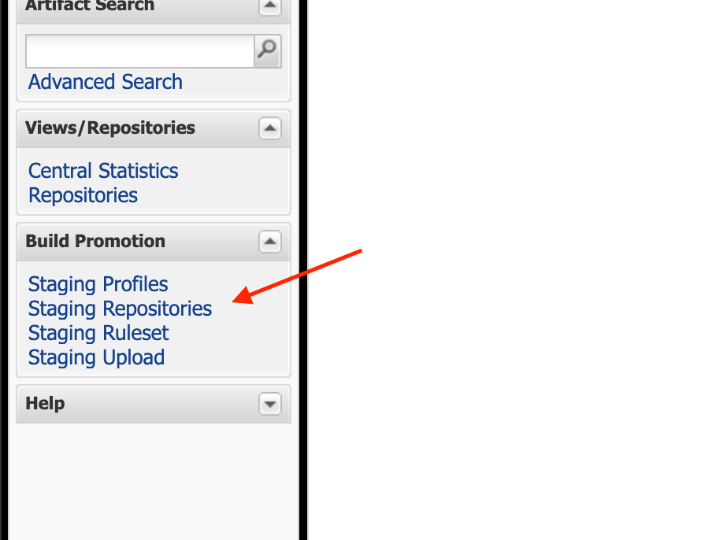

## Настройка приватных ключей

Создаем файл `~/.gradle/gradle.properties` и добавляем в него следующие записи:

```
ossrhUsername=1Swr8KZY
ossrhPassword=i8waV4jpanoWhvHVo1cLW8U1bbrDZ5Nc3Ukm9Re0R/Ca
signing_keyId=329C78F9
signing_password=976431
signing_secretKeyRingFile=~/.gradle/com.rees46.key.gpg
sonatype_rees46=1a52351fba7390
sonatype_personaclick=1a528b6d287289

```

Файл подписи:` com.rees46.key.gpg.`

## Сборка и отправка релиза

В корне проекта вводим:

`./gradlew publish`

При успешной загрузке увидим соответствующую надпись:


 ## Публикация релиза

Открываем https://s01.oss.sonatype.org/. 
Для авторизации вводим логин / пароль из файла `~/.gradle/gradle.properties` из полей `ossrhUsername` и `ossrhPassword`.
В левом меню нажимаем `Staging Repositories`.



Выбираем оба пакета и жмем кнопку `Close`, в модалке просто жмем `Confirm`.


После этого ждем пару минут, нажимаем кнопку `Refresh`. Ждем, чтобы в колонке `Status` изменился на closed. Когда статус изменился, жмем кнопку `Release`.


Все, спустя несколько часов новый пакет будет в https://mvnrepository.com/artifact/com.rees46/rees46-sdk и https://mvnrepository.com/artifact/com.personaclick/personaclick-sdk.
